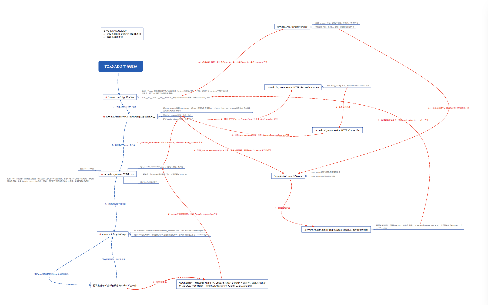

# tornado server


## 1. 介绍
* Tornado是一个用Python编写的异步HTTP服务器，同时也是一个web开发框架。
* Tornado优秀的大并发处理能力得益于它的web server，从底层开始就自己实现了一整套基于epoll的单线程异步架构。


## 2. 例子

### 同步做法
1. 对于同步阻塞型Web服务器，我们来打个比方，将它比作一间饭馆，而Web请求就是来这家饭馆里吃饭的客人。
2. 假设饭馆店里只有20个座位，那么同时能够就餐的客人数也就是20，剩下的客人被迫就在店门外等，如果客人们吃的太慢了，那么外面的客人等得不耐烦了，就会走掉（timeout）。
3. 假设你正在写一个需要请求一些来自其他服务器上的数据（比如数据库服务，调用其他http 接口获取数据）的应用程序，这几个请求假设需要花费5秒钟，如果这些代码运行在单个线程中，你的服务器只能每5秒接收一个客户端的请求。在这5秒钟的时间里，服务器不能干其他任何事情，所以，你的服务效率是每秒0.2个请求， 这样的效率时不能接受。
4. 大部分服务器会使用多线程技术来让服务器一次接收多个客户端的请求，我们假设你有20个线程，你将在性能上获得20倍的提高，所以现在你的服务器效率是每秒接受4个请求，但这还是太低了。

### 异步做法
1. 对于异步非阻塞型服务器，我们打另一个比方，将它比作一家超市，客人们想进就能进，前往货架拿他们想要的货物，然后再去收银台结账（callback），
2. 假设，这家超市只有20个收银台，却可以同时满足成百上千人的购物需求。和购物的时间长度比起来，结账的时间基本可以忽略不计。
3. 当我们在等待结果的时候不阻塞，转而我们给框架一个回调函数作为参数，让框架在收到结果的时候通过回调函数继续操作。
4. 这样，服务器就可以被解放去接受其他客户端的请求了。


## 3. application

### 背景
* Application本身不处理数据，只是封装URL, 解析请求的URL，分发到URL相对应的RequestHandler去执行具体操作

### 流程
1. 在新建一个app的时候，根据设置好的URL和回调函数Handler封装成URLSpec对象
2. 在请求到来，将HTTPServer封装好的HTTPRequest传入_RequestDispatcher对象，_RequestDispatcher对象根据传入的HTTPRequest使用URLSpec解析匹match正则匹配找到对应的RequestHandler，执行它的_execute方法


## 4. httpserver

### 介绍
* TCPServer作为工厂类，自身只做统一的端口绑定、监听、回调函数绑定的操作
* HTTPServer作为子类，实现数据接收类的创建，接受数据，最后封装成HTTPRequest对象，交给Application对象
* 在整个接收数据的过程中，并不能分辨出url是什么，该匹配哪个handler， 这件事是由Application对象来处理的

### 流程
1. 把包含了各种配置信息的application对象封装到了HttpServer对象的request_callback 字段中，等待被调用
2. TCPServer 通过listen方法启动端口监听， 封装_handle_connection回调函数，并注册到IOLoop中
3. 当有请求到来时，注册在IOLoop中的 handle_connection 将会被调用，_handle_connection方法将会调用handle_stream方法
4. handle_stream 方法是由HTTPServer重写TCPServer的方法，它将会创建HTTP1ServerConnection对象和ServerRequestAdapter对象并调用HTTP1ServerConnection对象的start_serving方法
5. start_serving 方法创建创建HTTP1Connection对象，并在方法server_request_loop中异步yield conn.read_response(request_delegate),接受请求发过来的数据，这里传入的delegate就是在HTTPServer中创建的ServerRequestAdapter对象
6. 在异步接收的时候，ServerRequestAdapter负责将数据封装成HTTPRequest对象， 接收完毕之后，调用ServerRequestAdapter的finish方法
7. 在调用_ServerRequestAdapter的finish方法时，数据就会调用application对象的call方法，这时就回到了Application类了

### 源码解析
```python
class TCPServer(object)：

    def listen(self, port, address=""):  #单进程启动
        sockets = bind_sockets(port, address=address)  #绑定socket监听端口
        self.add_sockets(sockets)  #添加监听

    def add_sockets(self, sockets):
        if self.io_loop is None:
            self.io_loop = IOLoop.current()  #获取IOLoop单例
        for sock in sockets:
            self._sockets[sock.fileno()] = sock
            #将封装好的self._handle_connection回调函数与sock对象一起绑定到IOLoop中，
            #这一步很重要，_handle_connection是封装之后的回调函数，在IOLoop中会回调它
            add_accept_handler(sock, self._handle_connection, io_loop=self.io_loop)

    #创建IOStream对象，并封装回调函数，被当做参数传递与IOLoop 绑定
    def _handle_connection(self, connection, address):
        try:
            #https相关
            if self.ssl_options is not None:
                stream = SSLIOStream(connection, io_loop=self.io_loop,
                                     max_buffer_size=self.max_buffer_size,
                                     read_chunk_size=self.read_chunk_size)
            else:
                #创建一个IOStream，主要用来读取HTTP数据流
                stream = IOStream(connection, io_loop=self.io_loop,
                                  max_buffer_size=self.max_buffer_size,
                                  read_chunk_size=self.read_chunk_size)
            #调用继承至 TCPServer的类的handle_stream方法（也就是HTTPServer 的handle_stream 方法）
            self.handle_stream(stream, address)
        except Exception:
            app_log.error("Error in connection callback", exc_info=True)


class HTTPServer(TCPServer, httputil.HTTPServerConnectionDelegate):
    #请求到来时，真正的数据处理方法
    def handle_stream(self, stream, address):
        context = _HTTPRequestContext(stream, address, self.protocol)
        #创建HTTP1ServerConnection对象，用来获取链接
        conn = HTTP1ServerConnection(stream, self.conn_params, context)
        self._connections.add(conn)
        conn.start_serving(self) #启动获取数据服务， 传递自己为代理

    def start_request(self, server_conn, request_conn): #将会在handle_stream添加进去的代理中执行
        return _ServerRequestAdapter(self, request_conn) #创建_ServerRequestAdapter对象， 开始接受封装数据
```

## 5. ioloop

### 介绍
* 将TCPServer 注册到 IOLoop 的事件记到 _handlers 字段，同时注册 READ 和 ERROR 事件到 epoll
* IOLoop 启动一个大循环，负责轮询epoll中是否已经有就绪的事件，如果有就执行对应的回调
* 目前支持4中事件

### 立即事件
* 场景：当前函数执行完后，下次ioloop调度时直接调度某函数
* 用法：ioloop.add_callback(callback, *args, **kwargs)
* 原理：立即事件全部存放在ioloop._callbacks中，ioloop每次循环都会调用这些立即事件的回调函数

```python
def start(self):
    while True:
        ncallbacks = len(self._callbacks) #self._callbacks用于存放所有的立即事件
        due_timeouts = []
        if self._timeouts:
            now = self.time()
            while self._timeouts:
                if self._timeouts[0].callback is None:
                    heapq.heappop(self._timeouts)
                    self._cancellations -= 1
                elif self._timeouts[0].deadline <= now:
                    due_timeouts.append(heapq.heappop(self._timeouts))
                else:
                    break
        for i in range(ncallbacks):
            self._run_callback(self._callbacks.popleft()) #循环调用所有的立即事件的回调函数
        for timeout in due_timeouts:
            if timeout.callback is not None:
                self._run_callback(timeout.callback)

        if self._callbacks: #如果在上面调用回调函数的过程中，又添加了新的立即事件，则将等待IO事件的时间设置为0，以便及时调用新的立即事件
            poll_timeout = 0.0
        elif self._timeouts:
            poll_timeout = self._timeouts[0].deadline - self.time()
            poll_timeout = max(0, min(poll_timeout, _POLL_TIMEOUT))
        else:
            poll_timeout = _POLL_TIMEOUT

        event_pairs = self._impl.poll(poll_timeout)
        self._events.update(event_pairs)
        while self._events:
            fd, events = self._events.popitem()
            fd_obj, handler_func = self._handlers[fd]
            handler_func(fd_obj, events)
```

### 定时器异步事件
* 场景：用户希望在某一段时间后执行某函数
* 用法：ioloop.call_at(when, callback, *args, **kwargs), ioloop.call_later(delay, callback, *args, **kwargs)
* 原理：定时器事件存放在ioloop._timeouts中，ioloop每次循环开始都会找出所有已经超时的定时器，并调用对应的回调函数

```python
def start(self):
    while True:
        ncallbacks = len(self._callbacks)
        due_timeouts = [] #用于存放超时的事件
        if self._timeouts: #self._timeouts用于存放所有定时器事件
            now = self.time()
            while self._timeouts:
                if self._timeouts[0].callback is None: #如果定时器事件没有回掉函数，则说明已经取消，直接丢弃
                    heapq.heappop(self._timeouts) #heapq是一个数据结构，它保证heapq[0]永远是最小的一个元素
                    self._cancellations -= 1
                elif self._timeouts[0].deadline <= now: #如果定时器已经超时，则取出并添加至due_timeouts中
                    due_timeouts.append(heapq.heappop(self._timeouts))
                else: #因为heapq的特性，如果执行到这一步，说明剩下事件都没有超时，退出循环
                    break
        for i in range(ncallbacks):
            self._run_callback(self._callbacks.popleft())
        for timeout in due_timeouts:
            if timeout.callback is not None:
                self._run_callback(timeout.callback) #循环调用所有已超时定时器事件的回调函数

        if self._callbacks:
            poll_timeout = 0.0
        elif self._timeouts:   #根据最小定时器事件的时间设置等待IO事件的时间
            poll_timeout = self._timeouts[0].deadline - self.time()
            poll_timeout = max(0, min(poll_timeout, _POLL_TIMEOUT))
        else:
            poll_timeout = _POLL_TIMEOUT

        event_pairs = self._impl.poll(poll_timeout)
        self._events.update(event_pairs)
        while self._events:
            fd, events = self._events.popitem()
            fd_obj, handler_func = self._handlers[fd]
            handler_func(fd_obj, events)
```

### IO异步事件
* 场景：等待某个文件描述符的某个事件，如TCPserver等待socket的READ事件
* 用法：ioloop.add_handler(fd, callback, events)
* 原理：所有的文件描述符全部存放在ioloop._impl中，windows平台下_impl是tornado.platform.select.SelectIOLoop对象
  在linux平台下_impl是tornado.platform.epoll.EPollIOLoop对象，作用都是同时监听多个文件描述符

```python
def start(self):
    while True:
        ncallbacks = len(self._callbacks)
        due_timeouts = []
        if self._timeouts:
            now = self.time()
            while self._timeouts:
                if self._timeouts[0].callback is None:
                    heapq.heappop(self._timeouts)
                    self._cancellations -= 1
                elif self._timeouts[0].deadline <= now:
                    due_timeouts.append(heapq.heappop(self._timeouts))
                else:
                    break
        for i in range(ncallbacks):
            self._run_callback(self._callbacks.popleft())
        for timeout in due_timeouts:
            if timeout.callback is not None:
                self._run_callback(timeout.callback)

        if self._callbacks:
            poll_timeout = 0.0
        elif self._timeouts:
            poll_timeout = self._timeouts[0].deadline - self.time()
            poll_timeout = max(0, min(poll_timeout, _POLL_TIMEOUT))
        else:
            poll_timeout = _POLL_TIMEOUT

        event_pairs = self._impl.poll(poll_timeout) #监听所有文件描述符
        self._events.update(event_pairs)
        while self._events:
            fd, events = self._events.popitem()
            fd_obj, handler_func = self._handlers[fd]
            handler_func(fd_obj, events)  #循环调用所有文件描述符对应的回调函数
```

### Future异步事件
* 场景：等待某个异步事件结束后执行回掉函数
* 用法：ioloop.add_future(future, callback)， future.add_done_callback(callback)
* 原理：异步事件结束后调用Future.set_result()，当执行set_result时将future所有的回掉函数添加为ioloop的立即事件

```python
class Future(object):
    def set_result(self, result):
        self._result = result
        self._set_done()

    def _set_done(self):
        self._done = True
        if self._callbacks:
            from tornado.ioloop import IOLoop
            loop = IOLoop.current()
            for cb in self._callbacks:
                loop.add_callback(cb, self) #将所有的回调函数设置为ioloop的立即事件
            self._callbacks = None
```

## 6. 流程图
